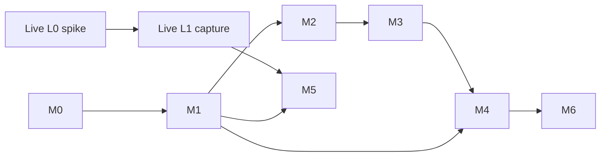

# Playtest Fixes

Plan triển khai sau buổi test **1 game do chính người chơi đánh và record** (2026-09-16),
chạy bằng `run_replay.py` (commit `d537eb0`). Soạn 2026-09-17. Trạng thái: **draft**.

## Mục tiêu

| # | Mục tiêu | Đo bằng | Đích |
|---|---|---|---|
| G1 | Đọc đúng mọi thẻ, kể cả sau reroll | Tỉ lệ thẻ đúng + reroll bắt được trên record có nhãn | ≥ 95% thẻ, 100% reroll |
| G2 | Tiền/cấp/XP đúng và **đổi được** lời khuyên | Sai số HUD ở mốc; % màn mà state đổi thứ hạng | Đúng ≥ 90%; > 0% đo được |
| G3 | Nhận xét có thông tin, không lặp | Câu trùng giữa 3 thẻ; người chơi chấm "có ích" | 0 câu trùng; ≥ 70% có ích |
| G4 | Kiến thức chuyên gia vào được advisor | Số luật đã duyệt; đồng thuận top-1 trên tập giữ lại | ≥ 30 luật; tăng so baseline |
| G5 | Replay và live cho **cùng kết quả** trên cùng video | Diff ranking `run_replay` vs `run_live --source video:` | 0 khác biệt |

## Vấn đề gốc (đã kiểm trong code)

| # | Vấn đề | Nguyên nhân |
|---|---|---|
| 1 | Nhận xét nghèo, lặp | Câu mẫu cố định; lặp trên 3 thẻ; **state thiếu** làm câu càng giống nhau |
| 2 | Sót lõi sau reroll | Replay chỉ đọc frame đầu màn; OCR 1 dòng; fuzzy 0.45 khớp nhầm |
| 3 | Tiền/EXP vô giá trị | HUD đọc lúc bị che → 0/1/100 giả; mất XP, tộc/hệ; tiền/cấp không vào điểm |
| 4 | Kiến thức chuyên gia | Chỉ nạp được tier list, chưa có "khi nào, vì sao" |

## Kiến trúc

Replay và live dev **song song trên một lõi chung** `src/live/` — [shared-core.md](shared-core.md).

## Roadmap

| Mốc | Nội dung | File chi tiết | Phụ thuộc | Công |
|---|---|---|---|---|
| **M0** | Bộ nhãn từ record + script đo baseline | [eval-dataset.md](eval-dataset.md) | — | 1 d |
| **M1** | Lõi `LiveSession` + `CardReader`; replay chạy trên lõi, hành vi tương đương | [core-session.md](core-session.md), [replay-shell.md](replay-shell.md) | M0 | 2.5 d |
| **M2** | Đọc đúng: reroll, OCR nhiều dòng, tộc/hệ, HUD priming | [augment-reroll-rescan.md](augment-reroll-rescan.md), [game-state-value.md](game-state-value.md) bước 0 | M1 | 2 d |
| **M3** | State vào điểm + dòng trạng thái | [game-state-value.md](game-state-value.md) bước 1–9 | M2 | 1.5 d |
| **M4** | Nhận xét mức A + luật chuyên gia + pilot 20 màn | [augment-commentary.md](augment-commentary.md), [expert-knowledge.md](expert-knowledge.md) | M1 (M3 cho câu state) | 2 d |
| **M5** | Vỏ live trên lõi chung, validate trong trận | [live-track.md](live-track.md) | M1 + L1 | 2 d |
| **M6** | Ghi chú soạn trước, LLM không chặn, fit trọng số | C mức B/C, D bước 6 | M4 + ~150 nhãn | 3 d |

## Ba track song song

| Track | Mốc | Ai | Ghi chú |
|---|---|---|---|
| **R** — lõi + replay | M0 → M3 | Claude | Tuần tự, là xương sống |
| **L** — capture live | L0, L1 → M5 | Claude + người chơi (L0 cần máy game) | Không đụng lõi đến M5 |
| **K** — kiến thức | Schema luật, scorer, gắn nhãn | Người chơi gắn nhãn; Claude làm công cụ | Bắt đầu sau M1 |

Tổng ≈ **11 ngày công** cho M0–M5; M6 sau khi có đủ nhãn.

## Definition of Done (mọi mốc)

- Test headless xanh (`pytest`), gồm `test_readonly_invariant.py`.
- Chỉ số của mốc đo lại trên record có nhãn, ghi vào [eval-dataset.md](eval-dataset.md).
- Commit nhỏ theo conventional commits; **hỏi trước khi push** (người chơi test trên máy khác).

## Quyết định cần người chơi

| Câu hỏi | Mặc định nếu chưa trả lời |
|---|---|
| Live dùng OCR hay Gemini để đọc thẻ? | OCR mặc định (không mạng); Gemini bật bằng config để so |
| Đọc chuỗi thắng/thua bằng ROI hay suy từ thay đổi HP? | Thêm ROI nếu HUD hiện số chuỗi; nếu không thì suy |
| Có người chơi thứ hai gắn nhãn độc lập? | Tập giữ lại 30% từ chính người chơi |

## Related

- [Risks](risks.md)
- [Live mode](../live-mode/overview.md)
- [Expert prior](../expert-prior/overview.md)
- [Next steps](../next-steps.md)
